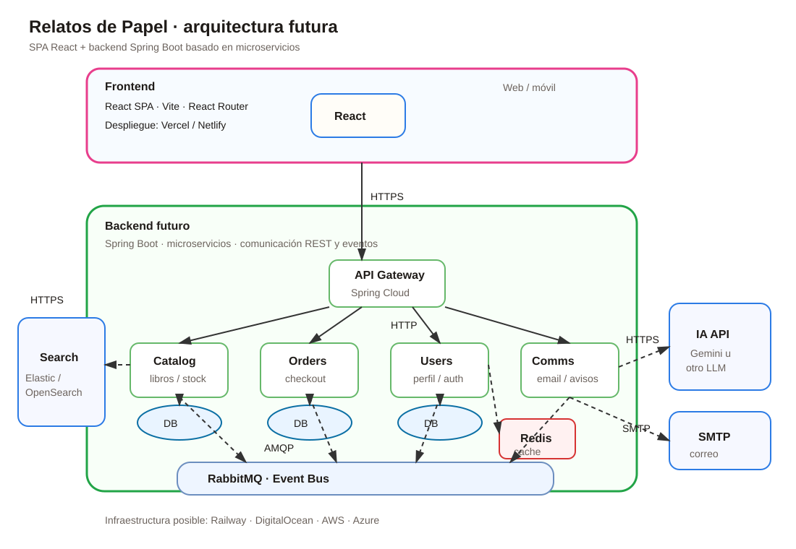

cli
# Arquitectura futura de Relatos de Papel

Este documento describe una posible evolucion arquitectonica de Relatos de Papel hacia una solucion full stack basada en una SPA React y un backend de microservicios. La arquitectura aqui descrita no forma parte del alcance implementado en la practica DWFS actual, pero sirve como referencia para la evolucion posterior del proyecto.

## Diagrama conceptual

## Vision general

La version actual es una SPA frontend con datos mock. En una evolucion futura, la aplicacion podria dividirse en dos grandes bloques:

- Frontend: SPA React desplegada en Vercel o Netlify.
- Backend: ecosistema de microservicios Spring Boot desplegado en Railway, DigitalOcean, AWS o Azure.

La comunicacion principal entre frontend y backend seria mediante HTTPS. Para funcionalidades de tiempo real, como notificaciones o actualizacion de estados, se podria usar WebSocket.

## Capa frontend

La capa frontend mantendria la aplicacion React como punto de entrada para usuarios web y moviles.

Responsabilidades:

- Presentar catalogo, detalle de libro, carrito, checkout y perfil.
- Gestionar navegacion con React Router.
- Consumir APIs REST del backend mediante HTTPS.
- Mostrar datos de usuario, pedidos, stock y estado de compra.
- Conectar con WebSocket si se incorporan notificaciones en tiempo real.

Posible despliegue:

- Vercel.
- Netlify.

## Capa de entrada backend

Entre el frontend y los microservicios se podria incorporar un API Gateway.

Responsabilidades del Gateway:

- Centralizar el acceso a los microservicios.
- Enrutar peticiones hacia catalogo, pedidos, usuarios o comunicaciones.
- Aplicar seguridad transversal.
- Gestionar autorizacion mediante tokens.
- Simplificar la comunicacion del frontend con el backend.

Tecnologias posibles:

- Spring Cloud Gateway.
- Spring Security.

## Microservicios propuestos

### Catalog service

Responsable del catalogo de libros.

Funciones:

- Gestionar libros fisicos y digitales.
- Consultar detalle de libro.
- Consultar disponibilidad y stock.
- Exponer busqueda y filtros.
- Publicar eventos relacionados con cambios de catalogo o stock.

Persistencia:

- Base de datos propia.
- Integracion con Elasticsearch u OpenSearch para busqueda avanzada.

### Orders service

Responsable de pedidos y checkout.

Funciones:

- Crear pedidos.
- Registrar lineas de pedido.
- Calcular totales.
- Gestionar estados del pedido.
- Emitir eventos de pedido creado, pagado, cancelado o enviado.

Persistencia:

- Base de datos propia.
- Comunicacion asincrona mediante RabbitMQ.

### Users service

Responsable de usuarios, perfil y autenticacion.

Funciones:

- Registro de usuarios.
- Login.
- Gestion de perfil.
- Asociacion de pedidos y recursos digitales al usuario.
- Gestion de permisos.

Persistencia y cache:

- Base de datos propia.
- Redis para cache o sesiones si el diseno lo requiere.

### Communications service

Responsable de comunicaciones y notificaciones.

Funciones:

- Enviar correos de confirmacion de pedido.
- Notificar cambios de estado.
- Gestionar avisos de soporte.
- Integrar SMTP.
- Consumir eventos desde RabbitMQ.

### Search service o motor de busqueda

Para busquedas avanzadas de libros se podria usar un componente externo basado en Elasticsearch u OpenSearch.

Funciones:

- Indexar libros.
- Buscar por titulo, autor, genero y palabras clave.
- Mejorar rendimiento y relevancia de resultados.

## Comunicacion entre servicios

La arquitectura podria combinar comunicacion sincrona y asincrona.

### Comunicacion sincrona

Usada cuando el cliente necesita respuesta inmediata.

Ejemplos:

- Consultar catalogo.
- Ver detalle de libro.
- Obtener perfil.
- Crear checkout.

Protocolo:

- HTTP/HTTPS.
- APIs REST.

### Comunicacion asincrona

Usada para desacoplar procesos internos.

Ejemplos:

- Pedido creado.
- Pago confirmado.
- Stock actualizado.
- Notificacion pendiente de envio.

Tecnologia posible:

- RabbitMQ como event bus.

## Integraciones externas posibles

### Pasarela de pago

El checkout real podria integrarse con una plataforma de pago externa.

Responsabilidades:

- Procesar pagos.
- Confirmar resultado de transaccion.
- Notificar al sistema mediante eventos o webhooks.

### LLM o API de IA

Una integracion con una API como Gemini podria utilizarse para funcionalidades auxiliares.

Ejemplos:

- Recomendaciones de lectura.
- Resumen de libros.
- Asistente de busqueda.
- Generacion de sugerencias personalizadas.

### Servidor SMTP

Usado por el servicio de comunicaciones.

Ejemplos:

- Confirmacion de pedido.
- Recuperacion de cuenta.
- Avisos de envio.

## Seguridad

En una version productiva, la seguridad no deberia depender del frontend.

Medidas esperadas:

- Autenticacion real en backend.
- Gestion de tokens.
- Validacion de permisos en Gateway y servicios.
- Comunicaciones HTTPS.
- Validacion de entradas.
- Proteccion de endpoints internos.
- Gestion segura de credenciales mediante variables de entorno.

## Observabilidad y despliegue

La solucion podria desplegarse en plataformas cloud o PaaS.

Opciones:

- Railway.
- DigitalOcean.
- AWS.
- Azure.

Aspectos recomendados:

- Logs centralizados.
- Health checks por servicio.
- Metricas de rendimiento.
- Trazabilidad de peticiones.
- Monitorizacion de errores.

## Relacion con la practica DWFS actual

La practica actual implementa solo el primer bloque de esta arquitectura: la SPA React. Los datos de catalogo, usuario y pedidos se simulan con mocks locales.

La arquitectura futura permitiria sustituir gradualmente los mocks por llamadas reales:

- `books.js` podria reemplazarse por `GET /books` y `GET /books/{id}`.
- `user.js` podria reemplazarse por endpoints de login y perfil.
- `orders.js` podria reemplazarse por endpoints de pedidos.
- El checkout simulado podria reemplazarse por un flujo real de pedido y pago.

Esta separacion permite que el frontend actual sea una base valida para evolucionar hacia una aplicacion full stack con microservicios.
